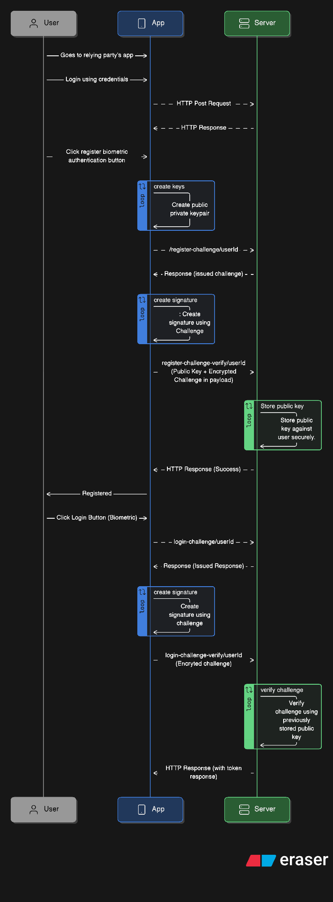

## Basic Usage

The library exposes all of the required methods in order to create a proper biometric authentication implementation using the native authentication methods (FaceID, Fingerprint). Instead of using a third-party solution like [Auth0](https://www.webauthn.me/introduction), you can create your signing and verification server. The diagram below shows a basic implementation / sequence of the flow that would be ideal for creating a secure biometric authentication for your app.

<div align="center">

</div>

## API Usage

### Check Biometric Support In Device

```ts
// Check if device has biometric hardware
const hasHardware = await ExpoBiometrics.hasHardware();
console.log('Device has biometric hardware:', hasHardware);

// Get supported authentication types
const supportedTypes = await ExpoBiometrics.supportedAuthenticationTypes();
console.log('Supported authentication types:', supportedTypes);
// Output: [1, 2] for fingerprint and facial recognition
```

### Check Biometric Enrollment

```ts
// Check if biometrics is enrolled
const isEnrolled = await ExpoBiometrics.isEnrolled();
console.log('Biometrics enrolled:', isEnrolled);

// Get security level
const securityLevel = await ExpoBiometrics.getEnrolledLevel();
console.log('Security level:', securityLevel);
// Output: 0 (NONE), 1 (SECRET), 2 (BIOMETRIC_WEAK), or 3 (BIOMETRIC_STRONG)
```

### Create Crytographic Keys

```ts
const createKeys = async () => {
	try {
		const result = await ExpoBiometrics.createKeys({
			keyAlias: 'myAppKey',
			keyType: 'ec256', // or 'rsa2048'
		});

		if (result.success) {
			console.log('Keys created successfully');
			console.log('Public key:', result.publicKey);
		} else {
			console.error('Failed to create keys:', result.error);
		}
	} catch (error) {
		console.error('Error creating keys:', error);
	}
};
```

### Create Signature

```ts
const createSignature = async () => {
	try {
		const result = await ExpoBiometrics.createSignature({
			payload: 'Data to be signed',
			keyAlias: 'myAppKey',
			promptMessage: 'Sign the data with your biometrics',
			promptSubtitle: 'Verify your identity',
			promptDescription: 'Use your fingerprint or face to sign the data',
			cancelLabel: 'Cancel',
			requireConfirmation: true,
		});

		if (result.success) {
			console.log('Signature created successfully');
			console.log('Signature:', result.signature);
			// Use the signature for verification
		} else {
			console.error('Failed to create signature:', result.error);
		}
	} catch (error) {
		console.error('Error creating signature:', error);
	}
};
```

### Delete Keys

```ts
const deleteKeys = async () => {
	try {
		const result = await ExpoBiometrics.deleteKeys({
			keyAlias: 'myAppKey',
		});

		if (result.success) {
			console.log('Keys deleted successfully');
		} else {
			console.error('Failed to delete keys');
		}
	} catch (error) {
		console.error('Error deleting keys:', error);
	}
};
```
